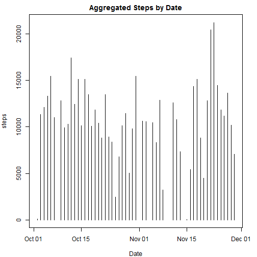
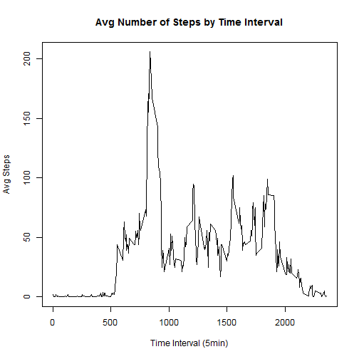

This is an R Markdown document. Markdown is a simple formatting syntax for authoring HTML, PDF, and MS Word documents. For more details on using R Markdown see <http://rmarkdown.rstudio.com>.

When you click the **Knit** button a document will be generated that includes both content as well as the output of any embedded R code chunks within the document. 

Read activity.csv.  Change the date column from character to Date.  Lookup day name based upon date column. Add Day Type column


```r
act <- read.csv("activity.csv",colClasses=c("numeric","character","numeric"))
act$date <- as.Date(act$date)
act$day <- weekdays(as.Date(act$date))
act$dayType <- ifelse(act$day %in% c("Sunday", "Saturday"),"weekend","weekday")
```

Check for complete data rows:


```r
ok <- complete.cases(act)
act1 <- act[ok,]
act2 <- act[!ok,]
numNA <- NROW(act2)
```

Number of rows with missing values is 2304.

The following is the plot of steps by date without NA's.

```r
par(mar=c(4,4,2,2))

plot(aggregate(act1$steps, by=list(act1$date), FUN=sum),type="h",xlab="Date",ylab="steps",main="Aggregated Steps by Date")
```

 

The median and means of the aggregated steps by date.

```r
aggrSteps <- aggregate(act1$steps, by=list(act1$date), FUN=sum)
summary(aggrSteps[,2])
```

```
##    Min. 1st Qu.  Median    Mean 3rd Qu.    Max. 
##      41    8841   10760   10770   13290   21190
```
The plot of the Average Number of Steps by Time Interval (5 min).

```r
avgSteps <- aggregate(act1$steps, by=list(act1$interval), FUN=sum)
avgSteps$avgsteps <- round(avgSteps[,2]/nrow(aggrSteps))
plot(avgSteps[,1],avgSteps$avgsteps,type="l",xlab="Time Interval (5min)",ylab="Avg Steps",main="Avg Number of Steps by Time Interval")
```

 

Replace NA in steps with mean of steps per interval:


```r
act1$stepsmean <- by(act1[,1],act1[,3],mean)

actInterval <- subset(act1,date == "2012-10-02",select = c(interval,stepsmean))
actInterval$stepsrnd <- round(actInterval[,2])

act$steps <- ifelse(is.na(act$steps),actInterval[,3],act$steps)
```

The median and means of the aggregated steps by date after replacing NA's.

```r
aggrSteps2 <- aggregate(act$steps, by=list(act$date), FUN=sum)
summary(aggrSteps2[,2])
```

```
##    Min. 1st Qu.  Median    Mean 3rd Qu.    Max. 
##      41    9819   10760   10770   12810   21190
```
The plot of the Average Number of Steps by Time Interval (5 min) after replacing NA's.

```r
avgSteps2 <- aggregate(act$steps, by=list(act$interval), FUN=sum)
avgSteps2$avgsteps <- round(avgSteps2[,2]/nrow(aggrSteps2))
plot(avgSteps2[,1],avgSteps2$avgsteps,type="l",xlab="Time Interval (5min)",ylab="Avg Steps",main="Avg Number of Steps by Time Interval")
```

 
